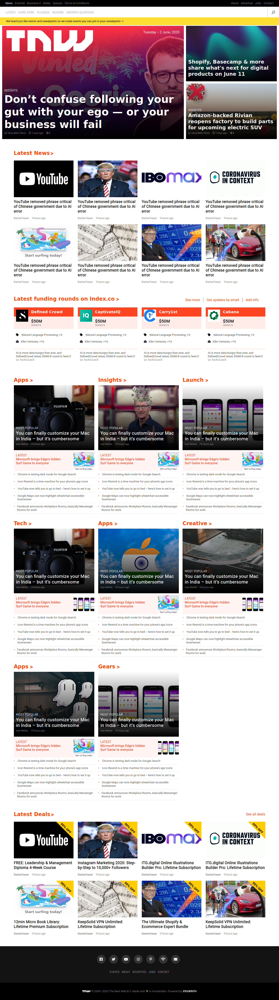

# Building with Responsive Design

> This is a clone of the_next_web homepage built with HTML and CSS3.



In this project, the authors designed a clone of [thenextweb](https://thenextweb.com/) home page demonstrating their understanding of responsive design as a concept of HTML and CSS3.

The page is designed to behave differently depending on various screen sizes ranging from mobile screens to desktop.

This project covers the following HTML and CSS3 concepts
- Meida Queries
- Floats and Positioning
- Flex and Grid
- Background and Gradients

## Built With
- HTML
- CSS

## Live Demo

[Live Demo Link](https://rawcdn.githack.com/RNtaate/The-Next-Web-Clone/31776f27bff42069dbaab4515521fe6520d0b3af/index.html)


## Getting Started
To get a local copy of this repository, please run the following commands on your terminal

```
$ cd <folder>
```

```
$ git clone https://github.com/RNtaate/The-Next-Web-Clone.git
```

## Authors

👤 **Witah Ngu Geojane**

- Github: [@Georjane](https://github.com/Georjane)
- Twitter: [@WittyJany](https://twitter.com/WittyJany)
- Linkedin: [witah](https://www.linkedin.com/in/witah-georjane-74b8bb184)

👤 **Roy Ntaate**

- Github: [@RNtaate](https://github.com/RNtaate)
- Twitter: [@RNtaate](https://twitter.com/RNtaate)
- Linkedin: [roy-ntaate](https://linkedin.com/in/roy-ntaate)


# 🤝 Contributing

Contributions, issues and feature requests are welcome!

Feel free to check the [issues page](https://github.com/RNtaate/The-Next-Web-Clone/issues).

## Show your support

Give a ⭐️ if you like this project!

## Acknowledgments

- This project was originally taken from [The Odin project](https://www.theodinproject.com/courses/html5-and-css3/lessons/building-with-responsive-design)
- The project was inspired by the [Microverse](https://www.microverse.org/) program.

## 📝 License

This project is [MIT](lic.url) licensed.
